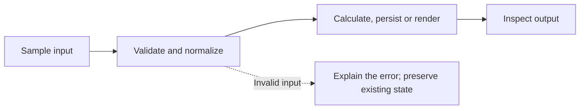
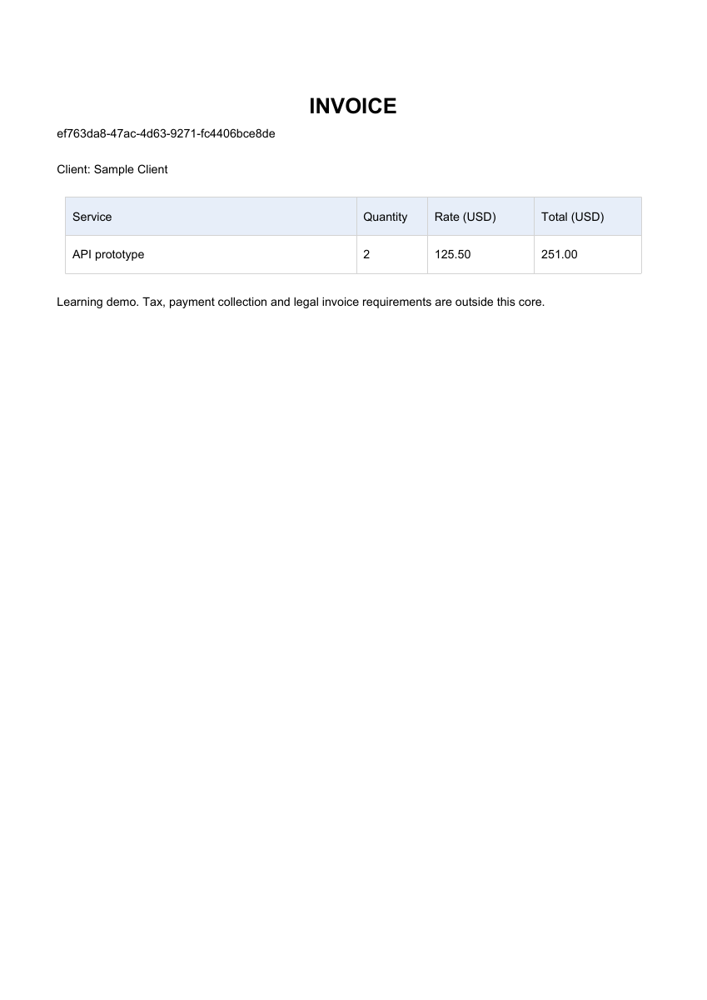

<div align="center">


**Four practical Python projects for learning validation, persistence, document generation and template rendering.**


[](https://github.com/yourclouddude)
[](https://yourclouddude.com/)

</div>

---

## Why these projects exist

Small applications expose the decisions that matter: validating money, generating identity, preserving data and escaping user input.

These four teaching cores let you follow those decisions from sample input to a visible result. Run the supplied example first, inspect a failure, then build an extension you can explain.

## Choose a project

| Project | Focus | Expected result |
| --- | --- | --- |
| [Expense Tracker](projects/06) | Decimal arithmetic, CSV validation, category summaries | Sample total 19.75; malformed row reported |
| [Bookstore REST API](projects/13) | FastAPI contracts, SQLite persistence, server-generated identity | Create a book with HTTP 201; retain it after restart |
| [Invoice Generator](projects/19) | Form validation, escaped previews, PDF bytes | Quantity 2 × rate 125.50 = 251.00 USD |
| [Portfolio Generator](projects/21) | Validated JSON, escaped templates, deterministic output | Generate a responsive local HTML portfolio |

## Run one project

Open the project's linked README and work from that folder. Use Python 3.12 and a separate virtual environment for each project; install only that folder's `requirements.txt`.

```sh
git clone https://github.com/yourclouddude/python-project-showcase.git
cd python-project-showcase/projects/06
python -m venv .venv
# Windows PowerShell: .\.venv\Scripts\Activate.ps1
# macOS/Linux: source .venv/bin/activate
python -m pip install -r requirements.txt
python main.py --file sample_expenses.csv
```

All examples run locally with synthetic/sample input. Bookstore and Invoice Generator both use port 8000 by default; run one server at a time or choose another `--port`.

## Follow the flow



## Invoice sample

This image is rendered from the supplied sample PDF, not a screenshot of a deployed service.



## Check the behavior

From the repository root, use a separate validation environment:

```sh
python -m pip install -r requirements-test.txt
python -m pytest test_showcase.py -q
```

Tests cover invalid money, malformed CSV, identity and persistence, HTTP validation, exact invoice totals, escaping and output collisions. All 12 selected-project checks passed locally. Recorded results are in `test-results.xml`. Each selected project previously passed an individual clean-install/offline smoke check on Windows x64 / Python 3.12.14.

## Learning and limits

Each of these four projects includes `PRACTICE.md`, a starter, hints, five checks and a separate worked answer. Implement `practice_starter.py` and run `python practice_checks.py` in that folder. Compare with `python practice_checks.py --reference` after attempting. The untouched starter intentionally fails. **20 worked-answer practice checks passed locally on 9 October 2026**; see [practice-validation.json](practice-validation.json). These are code checks, not measured human learning outcomes.


Predict the fixture output before running it. Change one requirement, reproduce a failure and document why a validation rule exists. Credit any help and explain your own changes.

These are local teaching cores. The API has no authentication/authorization; protected multi-user deployment is an extension. Other OS/Python combinations and public deployments are not claimed as validated. Sample identity and links are deliberate placeholders. Optional extensions in the project READMEs are exercises, not delivered features.


## Experiments to try next

| Project | Extension to build | Decision to explain |
| --- | --- | --- |
| Expense Tracker | Add monthly budgets | How should overspending be reported? |
| Bookstore REST API | Add pagination | What ordering keeps pages predictable? |
| Invoice Generator | Add an explicit tax rate | Where should rounding occur? |
| Portfolio Generator | Add another template | How will new fields remain safely escaped? |

These are suggested exercises; the repository contains the working cores described above.

## Questions you should be able to answer

- Why use Decimal for money rather than binary floating point?
- Why should the API generate a book's identity?
- What survives a server restart?
- How do escaped templates handle unexpected user input?
- Which checks would you add before exposing a local app to other users?

## Repository map

```text
.
├── projects/
│   ├── 06/                   # Expense Tracker
│   ├── 13/                   # Bookstore REST API
│   ├── 19/                   # Invoice Generator
│   └── 21/                   # Portfolio Generator
├── docs/
│   └── invoice-preview.png
├── requirements-test.txt
├── test_showcase.py
└── test-results.xml
```

---
<div align="center">

### YourCloudDude

**Build a working core. Understand its failure modes. Explain your design.**

[](https://yourclouddude.com/)


</div>
