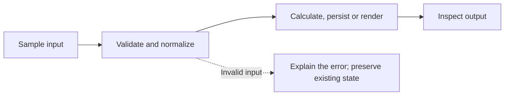

# Python Project Showcase

Four practical Python learning projects from YourCloudDude. Build a small working core, inspect a failure, then explain how the data reaches the output.

| Project | Focus | Expected result |
| --- | --- | --- |
| [Expense Tracker](projects/06) | Decimal arithmetic, CSV validation, category summaries | Sample total 19.75; malformed row reported |
| [Bookstore REST API](projects/13) | FastAPI contracts, SQLite persistence, server-generated identity | Create a book with HTTP 201; retain it after restart |
| [Invoice Generator](projects/19) | Form validation, escaped previews, PDF bytes | Quantity 2 × rate 125.50 = 251.00 USD |
| [Portfolio Generator](projects/21) | Validated JSON, escaped templates, deterministic output | Generate a responsive local HTML portfolio |

## Run one project

Open the project's linked README and work from that folder. Use Python 3.12 and a separate virtual environment for each project; install only that folder's `requirements.txt`.

```sh
git clone https://github.com/yourclouddude/python-project-showcase.git
cd python-project-showcase/projects/06
python -m venv .venv
# Windows PowerShell: .\.venv\Scripts\Activate.ps1
# macOS/Linux: source .venv/bin/activate
python -m pip install -r requirements.txt
python main.py --file sample_expenses.csv
```

All examples run locally with synthetic/sample input. Bookstore and Invoice Generator both use port 8000 by default; run one server at a time or choose another `--port`.

## Follow the flow



## Invoice sample

This image is rendered from the supplied sample PDF, not a screenshot of a deployed service.


## Check the behavior

From the repository root, use a separate validation environment:

```sh
python -m pip install -r requirements-test.txt
python -m pytest test_showcase.py -q
```

Tests cover invalid money, malformed CSV, identity and persistence, HTTP validation, exact invoice totals, escaping and output collisions. All 12 selected-project checks passed locally. Recorded results are in `test-results.xml`. Each selected project previously passed an individual clean-install/offline smoke check on Windows x64 / Python 3.12.14.

## Learning and limits

Predict the fixture output before running it. Change one requirement, reproduce a failure and document why a validation rule exists. Credit any help and explain your own changes.

These are local teaching cores. The API has no authentication/authorization; protected multi-user deployment is an extension. Other OS/Python combinations and public deployments are not claimed as validated. Sample identity and links are deliberate placeholders. Optional extensions in the project READMEs are exercises, not delivered features.

[YourCloudDude](https://yourclouddude.com/) · [More projects](https://github.com/yourclouddude)
